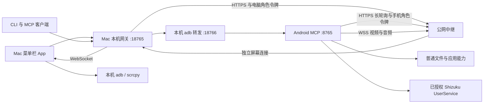

# 系统架构与源码归属

手机工位包含 Mac App、本机 MCP 网关、Android App 和公网中继。源码统一在本仓库；日常用法见 [README](../README.md)，协议见 [MCP](mcp.md) 与 [中继合约](relay-contract.md)。

手机 MCP 只监听手机回环地址。客户端访问 Mac 网关，网关优先选本地通道；公网中继承载同一批 MCP 请求，中继 3 另提供独立 WSS 屏幕连接；不提供完整 adb。手机主动连接中继，公网服务器不反向连接手机。

| 组件 | 源码 | 职责与交付 |
|---|---|---|
| Mac App | `app/mac/` | 原生菜单栏界面与会话协调；打包脚本、网关、钥匙串助手及 APK |
| Mac 网关 | `lib/remote-gateway/` | 本机客户端鉴权、权限过滤、共享队列、通道选择；不能当公网中继部署 |
| Android App | `lib/android/` | MCP 分发、普通文件、通知、剪贴板、任务回执与权限界面 |
| 公网中继 | `server/relay/` | 手机/电脑角色隔离、持久操作状态、请求转发与短期结果恢复 |
| 用户脚本 | `scripts/` | 按自身位置寻找内部实现，支持 `-h`；本地和远程入口分开 |

| 功能 | 本地通道 | 远程通道 | 额外条件 |
|---|---|---|---|
| 文件、设备状态、应用通知 | Android MCP 经 adb 转发 | 同一 MCP 经中继 | 对应手机权限；手机通知白名单由用户选择 |
| shell 与 APK 更新 | adb 或 MCP | MCP 后台任务与安装助手 | Shizuku 已运行且已授权；首次安装仍需要现有安装途径 |
| Mac 截屏、保持亮屏、手电筒 | 本地脚本 | MCP 控件 | 截屏/手电筒需要 Shizuku；亮屏需要写设置权限 |
| 交互式 shell | adb 终端 | MCP PTY 会话 | 手机 61+，Shizuku 已运行且授权；Mac 22+ 提供菜单入口 |
| 投屏、录屏 | adb / scrcpy | 独立 WSS 与原生 Mac 播放/MP4 保存 | Android 63、Mac 24、中继 3；已授权 Shizuku，见 [远程屏幕](remote-screen.md) |
| 灯光跟随声音 | adb | 不提供 | 本机 adb 在线；声音采集另需 macOS 授权 |
| 自动剪贴板 | MCP | 同一 MCP | 手机后台读取需要 Shizuku；Mac App 持续运行 |

机型相关操作目前只在荣耀 PGT-AN20 / Android 15 验证。远程机型检查使用 `station_controls_status`，不为核实型号强行连接 adb。

## 身份与数据边界

Mac 主令牌和受限客户端令牌只用于本机网关；受限令牌的范围见 [客户端权限](mcp-clients.md)。手机本地令牌随进程重启更换，只经受 DUMP 权限保护的诊断读取。公网手机和电脑使用不同角色令牌，分别保存在 Android Keystore、macOS 钥匙串和服务器私密配置中；TLS 使用固定 SPKI。

中继能够看到转发的请求与结果，不是端到端加密边界。中继 2 将结果正文存入权限 0600 的状态目录，最多 8 份 / 32 MiB，可读取窗口 10 分钟；完全空闲时的过期文件会留到下次维护请求或启动才清理，详见 [中继合约](relay-contract.md)。不持久保存请求正文、访问日志或令牌。普通文件数据、剪贴板与通知内容因此可能出现在结果缓存中，部署到自己管理或信任的主机。

## 请求与恢复

三种编号不能混用：MCP 的 JSON-RPC `id` 用来匹配应答；中继 `operationId` 用来防止转发重放；手机 `jobId` / 安装任务编号用来查询执行结果。应答丢失后按原手机任务编号查询，不重新提交有副作用的操作。中继 2 的编号为持久会话代号加电脑随机值；旧会话未保留的编号返回 410。

两端 App 更新、本机网关替换和公网中继更新分别验收。源码、构建、部署与恢复的记录格式见 [发布与回滚](releases.md)。个人服务器运维仓库维护实际主机和部署回执，本仓维护通用源码和协议；不保留第二份可修改的中继源码。
