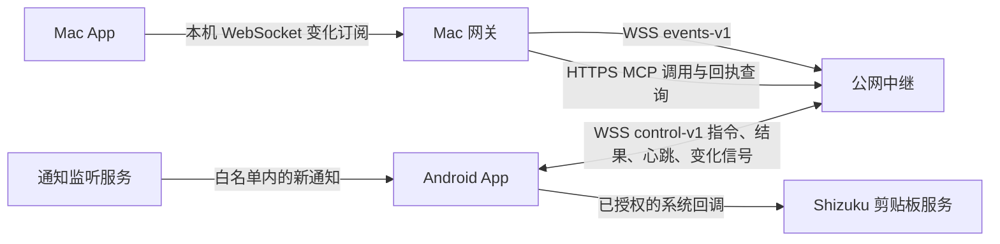

# 远程控制长连接与事件订阅

Android 69、Mac 32、中继 5 增加 `control-v1` 和 `events-v1`。三端升级后沿用已有配对、功能选择与授权，无需重新配对或新增公网端口；构建与实际部署证据见 [发布记录](releases.md)。操作回执仍使用 durable-epochs-v1，音视频仍使用独立的 [屏幕连接](remote-screen.md)。

## 哪些请求仍然定时发生

| 层次 | 新版行为 | 兼容与边界 |
| --- | --- | --- |
| 手机到中继的控制连接 | 常驻 WSS，即时接收指令；空闲每 20 秒心跳 | 只有能力接口明确 404 才回退旧版 2 秒长轮询 |
| Mac 网关到中继的在线检查 | 仍每 2 秒读取 status，复用 TLS；稳定控制会话每分钟完整 MCP ping | 首次、新会话、失败恢复或旧手机仍需要完整核验 |
| Mac 通知接收 | 已接受的订阅由变化唤醒，15 秒补查 | 未订阅或订阅失效时恢复约 2 秒轮询 |
| Mac 远程剪贴板交换 | 已接受的订阅由变化唤醒，30 秒补查 | 未订阅时沿用请求完成后至少 2 秒的空闲等待；新复制可立即调度 |
| Mac 本地剪贴板发现 | 仍每约 0.8 秒读取 changeCount | 负责发现 Mac 新复制，不是向手机发送请求的固定周期 |
| 本地 adb MCP 健康检查 | 仍每秒 ping | 与远程事件通道独立 |

事件订阅只在 Mac 当前选用远程通道、相应共享功能已开启且已有内容会话时建立。本地通道优先时不建立远程事件连接。减少的是手机空闲请求和重复内容查询；延迟与耗电变化需真机测量，不能仅凭周期推算为实际收益。

## 通道与兼容

手机先以手机角色请求 `POST /v1/phone/capabilities`，正文 `{}`。支持端返回 `controlProtocol: control-v1`，随后连接 `GET /v1/phone/control` WebSocket；仅明确 404 时使用原 2 秒长轮询，5 分钟后重新探测。认证、TLS、超时或长连接中断不触发协议降级。旧 Android 仍可使用 `/v1/phone/poll` 和 `/v1/phone/result`，旧 Mac 仍可使用原 HTTPS 调用。

手机 WSS 沿用手机角色令牌、SPKI 固定验证及主机名校验，认证只放请求头。控制帧为 UTF-8 JSON 文本，消息及分片合计上限 18 MiB，不启用压缩，不接受重定向。中继沿用 Origin、重复认证头、URL 参数、重复 JSON 字段和深度检查。

手机侧使用 Java-WebSocket 1.6.0 与 SLF4J 2.0.13（NOP 日志实现），构建时按固定 SHA-256 获取，缓存位于忽略的 `build/third_party/websocket/`。许可随 APK 附带：[Java-WebSocket MIT](licenses/java-websocket.txt)、[SLF4J MIT](licenses/slf4j.txt)。控制连接不依赖 Shizuku。

## 控制会话与结果

| 方向 | type | 内容与规则 |
| --- | --- | --- |
| 中继 → 手机 | `ready` | `protocol: control-v1`；收到后才确认应用层连接 |
| 中继 → 手机 | `operation` | `operationId`、原 MCP `payload`；先持久 running 再发送 |
| 手机 → 中继 | `result` | 原编号和 `response: {status,body}` |
| 中继 → 手机 | `result` | 原编号和确认 `status`；200 只在正文及完成回执落盘后发送 |
| 中继 ↔ 手机 | `heartbeat` | 空闲每 20 秒发起一次，手机立即应答；45 秒没有入站消息则断开 |
| 中继 → 手机 | `subscribe` | 当前订阅编号、Mac 剪贴板和通知 clientId；空编号表示取消 |
| 手机 → 中继 | `subscribed` | 当前订阅编号和两个能力的实际接受结果 |
| 手机 → 中继 | `event` | 当前订阅编号及 `clipboard` 或 `notifications` 主题；不含正文 |

长轮询和 WSS 共用派发代数。新网络上的已认证连接接替旧连接，旧代数不能派发新操作或刷新新连接状态；已经 running 的编号不重新派发。手机网络回调立即关闭旧 socket 并唤醒重试，常规连接失败继续有界指数退避。传输线程独立于工具执行，心跳不会被一次工具调用阻塞。

结果确认丢失时，手机可经原 HTTP result 接口重传相同结果。它不会重新进入 MCP dispatcher；中继同结果返回 200、冲突结果返回 409。中继重启、持久化失败及结果未知的处理与 [原合约](relay-contract.md) 相同。WebSocket 不能承诺副作用 exactly-once。

电脑角色的 status 增加 `controlProtocol`、`controlConnected`、`controlSession`。Mac 每 2 秒查询中继存在状态，复用该查询的 TLS 连接；对已验证且会话未变的 WSS 手机，不再每次发 MCP ping。首次连接、新会话、失败恢复及每满 1 分钟执行一次完整 MCP 核验。界面 RTT 保留最近的手机往返测量，不能把电脑到中继耗时显示成手机 RTT。旧手机继续原完整健康检查。

`controlProtocol` 表示服务端支持能力，`controlConnected` 才表示手机已建立控制连接；`controlSession` 随控制连接更换，不是操作编号的 `operationEpoch`。status 的 `version: "2"` 是持久协议版本，不能据此判断运行二进制仍为中继 2。手机 WSS 的存活窗口为 45 秒，旧轮询为 6 秒；Mac 网关仍要求最近 6 秒有成功的远程检查或业务应答，不能把这三种期限混用。

## 通知与剪贴板订阅

Mac 原生 App 使用完整网关身份连接本机 `/__subscription`，网关以电脑角色连接中继 `/v1/desktop/events`。受限客户端和浏览器 Origin 不可访问此入口。事件消息最多 4 KiB，持续连接按当前配置和凭据标识核对；配置改变时关闭旧通道。

App 仅在相应功能已开启、授权有效、已有内容接口会话时提交 clientId。订阅不能自行开启手机共享、申请权限、建立通知接收基线或修改剪贴板。中继给每次订阅生成新编号，并回送请求编号；旧连接、旧订阅及晚到的确认不能启用新订阅。一个电脑角色保留一个活跃订阅连接，新连接取代旧连接。

| 方向 | type | 含义 |
| --- | --- | --- |
| 中继 → Mac | `ready` | `protocol: events-v1`，随后才能提交订阅 |
| Mac → 中继 | `subscribe` | 新的 `requestId` 与既有剪贴板、通知 clientId；空字符串表示不订阅该主题 |
| 中继 → Mac | `subscribing` | 回送 requestId 和新 subscriptionId，只确认已受理 |
| 手机经中继 → Mac | `subscribed` | subscriptionId 与各主题的布尔接受结果；收到 true 后才降低对应轮询频率 |
| 手机经中继 → Mac | `event` | subscriptionId 与 topic，只唤醒原内容接口 |
| 中继 → Mac | `reset` | 手机控制会话变化，清除订阅成功状态并补查 |
| 中继 ↔ Mac | `heartbeat` | 每 20 秒发起、客户端应答；45 秒无入站消息关闭连接 |

Mac 将订阅变化、取消和心跳放进同一个有界串行发送队列，保持发送顺序。两种主题分别确认，剪贴板监听不可用不会阻止通知主题被接受。

手机接受订阅前再次检查分项远程权限、功能开关、已有 clientId，以及对应系统能力。通知沿用 NotificationListener 回调，先检查白名单及接收状态再读正文；剪贴板通过现有 Shizuku UserService 注册 IClipboard 变化监听，只回传变化信号，实际读取仍检查锁屏和敏感内容。监听签名不支持、服务未建立或授权缺失时拒绝该主题，Mac 保留原轮询。

活动订阅每 20 秒续租，单次租约最多 45 秒；续租只维持已经建立且未过期的同一 clientId，不创建新会话、不读取正文。通知配置或系统权限变化会重置接收状态。取消、断线或远程权限撤销后停止续租，撤销监听；网络黑洞下，以最后收到的续租期限为界。Mac 断线在中继被检测到前仍可能有最后一次续租，不能把 45 秒解释为物理断网后的绝对上限。

通知正文仍按原 20 秒保留期限独立清理，续租不会延长正文寿命。租约只维持接收资格，不能当作内容已消费的确认。

事件只唤醒原有接口：通知按原 cursor 查询，剪贴板按原 phoneVersion/macVersion 交换。手机端按主题合并连续变化；中继队列最多 16 帧，拥塞时结束连接，让客户端重连补查，不静默丢失。请求执行期间收到的新变化会保留为待补查状态，不能被请求完成覆盖。

收到手机的订阅成功确认后，Mac 通知从约 2 秒轮询改为事件触发加 15 秒补查，剪贴板改为事件触发加 30 秒补查。Mac 新复制仍立即进入现有调度。事件断线、手机重连或订阅失效时立即补查并恢复原轮询；重连沿用原内容接口的基线、游标、去重与冲突规则，不补扫历史通知、不重放旧复制写入。

Mac 重连按 1–30 秒退避。未收到手机主题确认时始终保留原轮询；认证或代理 Upgrade 失败不能通过关闭权限校验解决。

## 发布和验证边界

推荐先升级中继 5，再升级 Android 69 和 Mac 32。新中继兼容旧手机和 Mac；新手机连接旧中继时显式降级长轮询，新 Mac 的订阅连接失败时继续原轮询。中继前的反向代理必须透传控制和事件路径的 WebSocket Upgrade，已有屏幕代理规则不一定涵盖这两个新路径。

只替换传输协议和增加订阅租约，不改变持久状态格式。回滚使用能读取 durable-epochs-v1 的版本并保留完整状态目录；禁止删除旧回执。公网停启、手机安装、Mac 替换均需按 [发布流程](releases.md) 单独执行并核实恢复。

本机测试覆盖真实 TLS Java/Go 通信、SPKI 拒绝、持久结果确认、原结果重传、连接接替、静默连接超时、订阅隔离、变化信号正文剥离、同 clientId 租约过期、Mac 晚到确认拒绝及请求期间补查。手机 Wi-Fi/蜂窝/VPN 切换、后台保活、通知即时性、PGT-AN20 系统剪贴板监听兼容与实际耗电必须部署后实测，本机通过不能替代这些验收。
